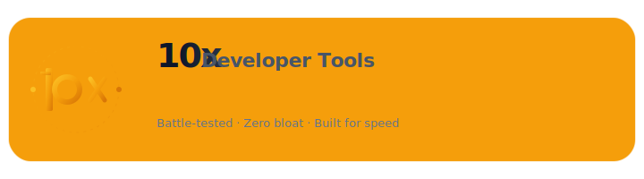

<picture>
  <source media="(prefers-color-scheme: dark)" srcset=".github/assets/logo-dark.svg">
  <source media="(prefers-color-scheme: light)" srcset=".github/assets/logo-light.svg">
  
</picture>

<p align="center">
  <a href="LICENSE"></a>
  <a href="#plugins"></a>
  <a href="https://github.com/Aboudjem/10x/stargazers"></a>
</p>

<p align="center">Curated developer tools for Claude Code. No bloat. Battle-tested.</p>

---

## Install

```bash
claude plugin marketplace add Aboudjem/10x
```

Then install any plugin:

```bash
claude plugin install sniff@10x
claude plugin install ui-ux-suite@10x
```

That's it. Each plugin brings its MCP tools, slash commands, and agents automatically.

---

## Plugins

### sniff

AI-powered QA testing. Scans source code for bugs, checks accessibility, visual regression, and performance. Auto-detects your dev server. No config needed.

**Slash commands:** `/sniff` `/sniff-fix` `/sniff-report`

**MCP tools:** `sniff_scan` `sniff_run` `sniff_report`

[GitHub](https://github.com/Aboudjem/sniff) · [npm](https://www.npmjs.com/package/sniff-qa)

### ui-ux-suite

Design audit tool. Scores projects across 12 dimensions: color contrast, typography, accessibility, layout, and more. WCAG 2.1, APCA, and OKLCH color science. Zero dependencies.

**Slash commands:** `/design-audit` `/color-audit` `/type-audit` `/layout-audit` `/a11y-audit` and 9 more

**MCP tools:** 14 tools for scanning, scoring, and token generation

[GitHub](https://github.com/Aboudjem/ui-ux-suite) · [npm](https://www.npmjs.com/package/ui-ux-suite)

---

## Works with any AI editor

These tools also work as standalone MCP servers with Cursor, VS Code, Codex, Gemini, Windsurf, and Continue.dev:

```bash
npx sniff-qa --mcp
npx ui-ux-suite --mcp
```

See each project's README for editor-specific setup.

---

## What makes it 10x

Every plugin here passes a quality bar:

- **Zero bloat.** Vanilla Node.js, no runtime dependencies
- **Clear docs.** Install in one command, usage is obvious
- **Real tests.** Not aspirational, not "coming soon"
- **Dual mode.** Works as Claude Code plugin AND as MCP server for any editor
- **Active.** Maintained, not abandoned

If a plugin stops meeting this bar, it gets removed.

---

## Contributing

Have a plugin that belongs here? See [CONTRIBUTING.md](CONTRIBUTING.md).

---

<p align="center">
  If 10x helped you ship better code, consider starring it.<br/>
  It helps others find these tools.
</p>

---

<p align="center">
  <a href="https://www.linkedin.com/in/adam-boudjemaa/"></a>
  <a href="https://x.com/AdamBoudj"></a>
  <a href="https://adam-boudjemaa.com/"></a>
</p>

<p align="center">
  <sub>Built by <a href="https://github.com/Aboudjem">Adam Boudjemaa</a> · MIT License · No telemetry · No data collection</sub>
</p>
