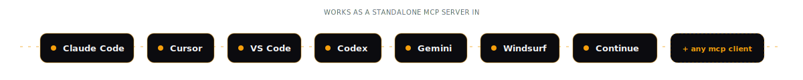

<picture>
  <source media="(prefers-color-scheme: dark)" srcset=".github/assets/logo-dark.svg">
  <source media="(prefers-color-scheme: light)" srcset=".github/assets/logo-light.svg">
  
</picture>

<p align="center">
  <a href="LICENSE"></a>
  <a href="#plugins"></a>
  <a href="https://github.com/Aboudjem/10x/stargazers"></a>
</p>

<p align="center"><b>Curated developer tools for Claude Code.</b><br/>No bloat. Battle-tested. Works in any AI editor.</p>

---

## How it works

<p align="center">
  
</p>

<p align="center"><i>One install command. Every plugin wires up its MCP tools, slash commands, and agents automatically.</i></p>

```bash
claude plugin marketplace add Aboudjem/10x
```

---

## Plugins

Two plugins today. Every one of them passes the [quality bar](#the-10x-bar) below.

### &nbsp;&nbsp;Find bugs before your users do

<p align="center">
  
</p>

AI-powered QA that scans source code, your running dev server, or both. Auto-detects your framework and port. No API keys, no Playwright install, no config.

```bash
claude plugin install sniff@10x     # as a plugin
npx sniff-qa                        # as a standalone CLI
```

<table>
<tr>
<td width="50%" valign="top">

**Slash commands**
- `/sniff` — scan your project
- `/sniff-fix` — apply safe fixes
- `/sniff-report` — open last scan

</td>
<td width="50%" valign="top">

**MCP tools**
- `sniff_scan` — source + a11y + perf
- `sniff_run` — live site checks
- `sniff_report` — formatted results

</td>
</tr>
</table>

<p>
  <a href="https://github.com/Aboudjem/sniff">GitHub →</a> &nbsp;·&nbsp;
  <a href="https://www.npmjs.com/package/sniff-qa">npm →</a>
</p>

---

### &nbsp;&nbsp;Your design quality, measured

<p align="center">
  
</p>

Scans your CSS, JSX, and Tailwind config. Scores 12 design dimensions — color, typography, accessibility, layout, components, motion, performance, psychology, platform, density, and style. Cites the UX law each finding violates, then gives you the fix. Zero dependencies, 100% local.

```bash
claude plugin install ui-ux-suite@10x   # as a plugin
npx ui-ux-suite                         # as a standalone CLI
```

<table>
<tr>
<td width="50%" valign="top">

**Slash commands**
- `/design-audit` — full 12-dim audit
- `/color-audit` — contrast + palette
- `/type-audit` — typography only
- `/layout-audit` — spacing + grid
- `/a11y-audit` — WCAG 2.1 + APCA
- `+ 9 more specialist audits`

</td>
<td width="50%" valign="top">

**MCP tools**
- `uiux_scan_project` — detect stack
- `uiux_extract_colors` — palette
- `uiux_check_contrast` — WCAG/APCA
- `uiux_generate_tokens` — design system
- `+ 10 more scoring & generation tools`

</td>
</tr>
</table>

<p>
  <a href="https://github.com/Aboudjem/ui-ux-suite">GitHub →</a> &nbsp;·&nbsp;
  <a href="https://www.npmjs.com/package/ui-ux-suite">npm →</a>
</p>

---

## Works with any AI editor

<p align="center">
  
</p>

Every 10x plugin is **dual mode** — install it as a Claude Code plugin, or run it as a plain MCP server in the editor of your choice:

```bash
npx sniff-qa       --mcp
npx ui-ux-suite    --mcp
```

Each project's README has copy-paste snippets for Cursor, VS Code + Copilot, Codex, Gemini, Windsurf, and Continue.dev.

---

## The 10x bar

Every plugin here passes this bar. If it stops passing, it gets removed.

| | |
|---|---|
| **Zero bloat** | Vanilla Node.js, no runtime dependencies |
| **One-command install** | No config files, no API keys |
| **Real tests** | Not aspirational, not "coming soon" |
| **Dual mode** | Works as a Claude Code plugin AND as an MCP server |
| **Actively maintained** | Shipped this quarter, not abandoned last year |
| **No telemetry** | Runs locally, your code never leaves your machine |

---

## Contributing

Got a plugin that belongs here? See [CONTRIBUTING.md](CONTRIBUTING.md).

---

<p align="center">
  If 10x helped you ship better code, consider starring it.<br/>
  It helps other devs find these tools.
</p>

<p align="center">
  <a href="https://www.linkedin.com/in/adam-boudjemaa/"></a>
  <a href="https://x.com/AdamBoudj"></a>
  <a href="https://adam-boudjemaa.com/"></a>
</p>

<p align="center">
  <sub>Built by <a href="https://github.com/Aboudjem">Adam Boudjemaa</a> · MIT License · No telemetry · No data collection</sub>
</p>
