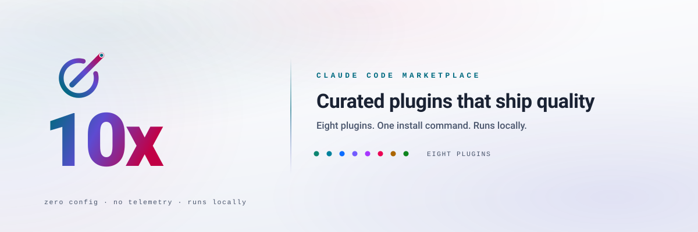

<picture>
  <source media="(prefers-color-scheme: dark)" srcset=".github/assets/hero-banner-dark.svg">
  <source media="(prefers-color-scheme: light)" srcset=".github/assets/hero-banner-light.svg">
  
</picture>

<p align="center">
  <a href="LICENSE"></a>
  <a href="https://github.com/Aboudjem/10x/actions/workflows/validate.yml"></a>
  <a href="https://github.com/Aboudjem/10x/stargazers"></a>
</p>

<p align="center">
  <b>English</b> ·
  <a href="READMEs/zh-CN.md">简体中文</a> ·
  <a href="READMEs/ja.md">日本語</a> ·
  <a href="READMEs/es.md">Español</a> ·
  <a href="READMEs/fr.md">Français</a>
</p>

<p align="center"><b>A plugin marketplace is a list your editor can install from. This one holds seven developer tools for Claude Code, and you add it once.</b></p>

<p align="center">
  <a href="#install">Install</a> ·
  <a href="#the-plugins">The plugins</a> ·
  <a href="#what-each-one-does">What each one does</a> ·
  <a href="#works-with-any-ai-editor">Works with any AI editor</a> ·
  <a href="#the-10x-bar">The 10x bar</a>
</p>

```bash
claude plugin marketplace add Aboudjem/10x
```

## Install

Add the marketplace once. Claude Code can then install any of the seven by name.

```bash
claude plugin marketplace add Aboudjem/10x
claude plugin install sniff@10x
```

Swap `sniff` for any name in the table below. Outside Claude Code, the same skills install through
the [Vercel skills CLI](https://github.com/vercel-labs/skills), which installs them into the directory
your agent reads:

```bash
npx skills add Aboudjem/sniff
```

## The plugins

| | Plugin | What it is for | Install | |
|:-:|:--|:--|:--|:--|
|  | **sniff** | Walks your running app and finds real bugs | `claude plugin install sniff@10x` | [repo](https://github.com/Aboudjem/sniff) |
|  | **ui-ux-suite** | ESLint for design: the line, the value, the fix | `claude plugin install ui-ux-suite@10x` | [repo](https://github.com/Aboudjem/ui-ux-suite) |
|  | **recap-studio** | One offline HTML explainer from a topic or a session | `claude plugin install recap-studio@10x` | [repo](https://github.com/Aboudjem/recap-studio) |
|  | **aws-cost-audit** | Audits your AWS bill against live AWS pricing | `claude plugin install aws-cost-audit@10x` | [repo](https://github.com/Aboudjem/aws-cost-audit-skill) |
|  | **goalify** | Preps a huge task to run on its own | `claude plugin install goalify@10x` | [repo](https://github.com/Aboudjem/goalify) |
|  | **humanizer** | Names 55 AI writing habits and rewrites them | `claude plugin install humanizer@10x` | [repo](https://github.com/Aboudjem/humanizer-skill) |
|  | **loopify** | Preps a repeating job for Claude Code's `/loop` | `claude plugin install loopify@10x` | [repo](https://github.com/Aboudjem/loopify) |

## What each one does

### sniff

Point it at your running app and it clicks through your real flows in a real browser, then tells you what broke and the ordered steps that broke it.

`claude plugin install sniff@10x`

[GitHub](https://github.com/Aboudjem/sniff) · [npm](https://www.npmjs.com/package/sniff-qa)

### ui-ux-suite

It reads your CSS, JSX, HTML and Tailwind classes and names the file, the line, the measured wrong value, and the exact fix. It audits, it never edits.

`claude plugin install ui-ux-suite@10x`

[GitHub](https://github.com/Aboudjem/ui-ux-suite) · [npm](https://www.npmjs.com/package/ui-ux-suite)

### recap-studio

It turns a topic or a coding session into one HTML file you can double-click, with every style inlined and no external request, readable offline in about five minutes.

`claude plugin install recap-studio@10x`

[GitHub](https://github.com/Aboudjem/recap-studio) · [Architecture](https://github.com/Aboudjem/recap-studio/blob/main/docs/architecture.md)

### aws-cost-audit

It reads your live AWS account through the AWS CLI you already have and hands you a savings plan where every price is checked live, never quoted from memory.

`claude plugin install aws-cost-audit@10x`

[GitHub](https://github.com/Aboudjem/aws-cost-audit-skill)

### goalify

For a job too big to sit and watch, it writes the brief (a file holding what the run has to do) and the condition (one line you paste into `/goal`), so a fresh session does the work and closes by quoting the checks passing.

`claude plugin install goalify@10x`

[GitHub](https://github.com/Aboudjem/goalify)

### humanizer

It names 55 habits that make writing read as machine-written, scores how many your text carries on a 0 to 100 scale, and rewrites it in the voice you pick.

`claude plugin install humanizer@10x`

[GitHub](https://github.com/Aboudjem/humanizer-skill)

### loopify

For a job that repeats rather than finishes, it writes the brief and the line you paste into `/loop`, Claude Code's built-in repeat command, with a tick cap and a stop rule. Every tick logs what it did.

`claude plugin install loopify@10x`

[GitHub](https://github.com/Aboudjem/loopify)

## Works with any AI editor

<p align="center">
  
</p>

Every plugin here ships as skills, which are Markdown files your agent reads. That is why all seven
install outside Claude Code through `npx skills add`, whose own README lists 77 supported agents.
Three are also command-line tools. sniff and ui-ux-suite each run as a standalone MCP server straight
from npm, the protocol an editor speaks to reach an outside tool. recap-studio ships one too, run
from a clone after a workspace build. The other four are skills only.

| Agent | One-line install |
|:--|:--|
| Claude Code | `claude plugin install <name>@10x` |
| Cursor, Codex, Copilot, Gemini CLI, and [70+ more](https://github.com/vercel-labs/skills#supported-agents) | `npx skills add Aboudjem/<repo>` |
| Any MCP client (sniff, ui-ux-suite) | `npx sniff-qa --mcp`, `npx ui-ux-suite --mcp` |
| Everything else | see `docs/editors.md` in the plugin's own repo |

## The 10x bar

| | |
|---|---|
| **Lean by default** | No dependency a plugin does not need. sniff drives a real browser, so it carries Playwright and Lighthouse; the rest ship with none. |
| **One-command install** | No config file, no signup, no API key to start. |
| **Real tests** | CI that asserts behaviour, not that a file exists. |
| **Runs outside Claude Code** | Installs into [70+ agents](https://github.com/vercel-labs/skills#supported-agents) through `npx skills add`. |
| **Actively maintained** | A release this quarter, not an archive from last year. |
| **No telemetry** | No analytics and no phoning home. Each tool talks only to what you point it at. |

Every plugin listed here passes this bar. If one stops passing, it gets removed. The full checklist,
with the roster and the last verification date, is in [QUALITY-BAR.md](QUALITY-BAR.md).

## Contributing

Have a plugin that belongs here? [CONTRIBUTING.md](CONTRIBUTING.md) has the proposal steps.
A workflow syncs every version pin from the plugin's own repo; [docs/SYNC.md](docs/SYNC.md) explains the chain.

<p align="center">
  <sub>Built by <a href="https://github.com/Aboudjem">Adam Boudjemaa</a> · MIT License · No telemetry, no data collection</sub>
</p>
