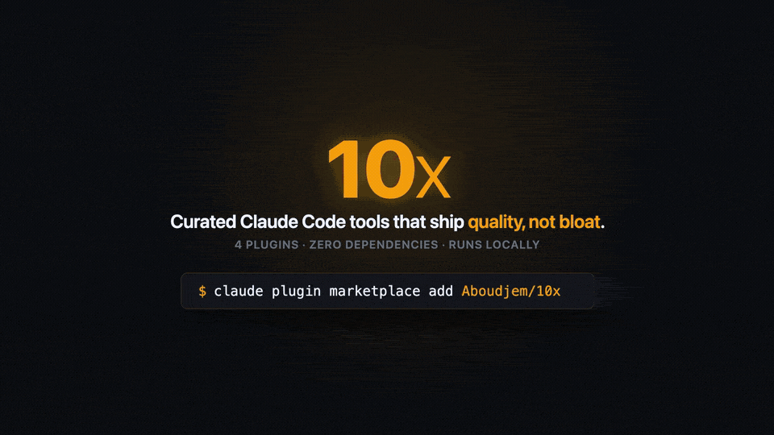
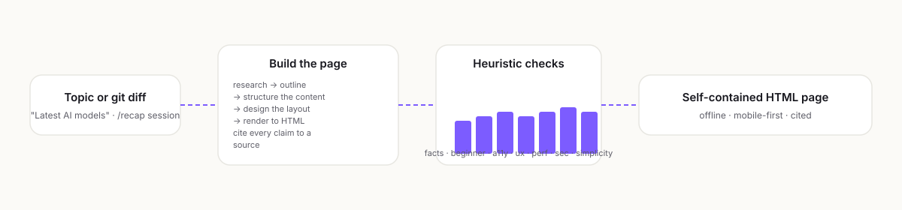
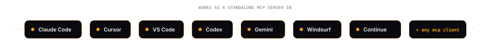

<picture>
  <source media="(prefers-color-scheme: dark)" srcset=".github/assets/logo-dark.svg">
  <source media="(prefers-color-scheme: light)" srcset=".github/assets/logo-light.svg">
  
</picture>

<p align="center">
  <a href="LICENSE"></a>
  <a href="#plugins"></a>
  <a href="https://github.com/Aboudjem/10x/stargazers"></a>
</p>

<p align="center">
  <b>English</b> ·
  <a href="READMEs/zh-CN.md">简体中文</a> ·
  <a href="READMEs/ja.md">日本語</a> ·
  <a href="READMEs/es.md">Español</a> ·
  <a href="READMEs/fr.md">Français</a>
</p>

<p align="center"><b>A curated marketplace of developer tools for Claude Code.</b><br/>No bloat. Tested. Works in any AI editor.</p>



---

## How it works

<p align="center">
  
</p>

<p align="center"><i>One install command. Every plugin wires up its MCP tools, slash commands, and agents automatically.</i></p>

```bash
claude plugin marketplace add Aboudjem/10x
```

> [!TIP]
> One install command. Every plugin wires up its MCP tools, slash commands, and agents automatically.

---

## Plugins

Six plugins today. Every one of them passes the [quality bar](#the-10x-bar) below.

> [!TIP]
> Want to see them run? Each tool repo has its own demo: [sniff](https://github.com/Aboudjem/sniff#readme), [ui-ux-suite](https://github.com/Aboudjem/ui-ux-suite#readme), [recap-studio](https://github.com/Aboudjem/recap-studio#readme), [aws-cost-audit](https://github.com/Aboudjem/aws-cost-audit-skill#readme), [goalify](https://github.com/Aboudjem/goalify#readme), and [humanizer](https://github.com/Aboudjem/humanizer-skill#readme).

### &nbsp;&nbsp;Find bugs before your users do

<p align="center">
  
</p>

AI-powered QA that walks your running app like a user, discovers its flows, and finds real bugs across accessibility, performance, and broken interactions. Auto-detects your dev server. A source scan is also available via `sniff scan`. No API keys, no config.

```bash
claude plugin install sniff@10x     # as a plugin (primary)
npx sniff-qa                        # as a standalone CLI
# one-line multi-CLI install (Cursor, Codex, Gemini, Copilot, and more):
curl -fsSL https://raw.githubusercontent.com/Aboudjem/sniff/main/install.sh | bash -s codex
```

<table>
<tr>
<td width="50%" valign="top">

**Slash commands**
- `/sniff` - walk your running app
- `/sniff-fix` - apply safe fixes
- `/sniff-report` - open last scan

</td>
<td width="50%" valign="top">

**MCP tools**
- `sniff` - walk your running app (unified)
- `sniff_scan` - source-only scan
- `sniff_report` - formatted results

</td>
</tr>
</table>

<p>
  <a href="https://github.com/Aboudjem/sniff">GitHub →</a> &nbsp;·&nbsp;
  <a href="https://www.npmjs.com/package/sniff-qa">npm →</a>
</p>

---

### &nbsp;&nbsp;Your design quality, measured

<p align="center">
  
</p>

Scans your CSS, JSX, and Tailwind config. Scores 12 design dimensions: accessibility, color system, typography, layout and spacing, component quality, visual hierarchy, interaction quality, responsiveness, visual polish, performance UX, information architecture, and platform appropriateness. Cites the UX law each finding violates, then shows you the exact fix. It audits, it never edits. Zero dependencies, 100% local.

```bash
claude plugin install ui-ux-suite@10x   # as a plugin (primary)
npx ui-ux-suite                         # as a standalone CLI
# one-line multi-CLI install (Cursor, Codex, Gemini, Copilot, and more):
curl -fsSL https://raw.githubusercontent.com/Aboudjem/ui-ux-suite/main/install.sh | bash -s codex
```

<table>
<tr>
<td width="50%" valign="top">

**Slash commands**
- `/design-audit` - full 12-dim audit
- `/color-audit` - contrast + palette
- `/type-audit` - typography only
- `/layout-audit` - spacing + grid
- `/a11y-audit` - WCAG 2.2 + APCA
- `+ 9 more specialist audits`

</td>
<td width="50%" valign="top">

**MCP tools**
- `uiux_scan_project` - detect stack
- `uiux_extract_colors` - palette
- `uiux_check_contrast` - WCAG/APCA
- `uiux_generate_tokens` - design system
- `+ 10 more scoring & generation tools`

</td>
</tr>
</table>

<p>
  <a href="https://github.com/Aboudjem/ui-ux-suite">GitHub →</a> &nbsp;·&nbsp;
  <a href="https://www.npmjs.com/package/ui-ux-suite">npm →</a>
</p>

---

### &nbsp;&nbsp;One-page explainers in under 5 minutes

<p align="center">
  
</p>

Turn any topic or coding session into a clean, mobile-first one-page explainer a smart 18-year-old can read in 5 minutes. Output is a self-contained, offline HTML page. Deterministic heuristic checks validate clarity, accessibility, and structure before you ship, and every claim is cited.

```bash
claude plugin install recap-studio@10x   # as a plugin (primary)
/recap "Latest AI models"                # in any Claude Code session
# one-line multi-CLI install (Cursor, Codex, Gemini, Copilot, and more):
curl -fsSL https://raw.githubusercontent.com/Aboudjem/recap-studio/main/install.sh | bash -s codex
```

<table>
<tr>
<td width="50%" valign="top">

**Slash commands**
- `/recap "<topic>"` - full explainer page
- `/recap session` - coding-session recap
- `/recap setup` - write safe-default config
- `/recap validate` - re-score the active page

</td>
<td width="50%" valign="top">

**What you get**
- A self-contained offline HTML page
- Every claim cited to a source
- Deterministic heuristic checks (clarity, a11y, structure)
- Optional deploy path (off by default)

</td>
</tr>
</table>

<p>
  <a href="https://github.com/Aboudjem/recap-studio">GitHub →</a> &nbsp;·&nbsp;
  <a href="https://github.com/Aboudjem/recap-studio/blob/main/docs/architecture.md">Architecture →</a>
</p>

---

### &nbsp;&nbsp;Audit your AWS bill, safely

<p align="center">
  
</p>

Reads your live AWS account (read-only by default), attributes every dollar, and finds idle, orphaned, and over-provisioned resources. Verifies every price live against the AWS Price List API (it hardcodes none) and gives each finding a confidence level, the evidence behind it, and a rollback. Nothing gets deleted without proof and your sign-off.

```bash
claude plugin install aws-cost-audit@10x   # as a plugin (primary)
# one-line install into another CLI's skills directory:
curl -fsSL https://raw.githubusercontent.com/Aboudjem/aws-cost-audit-skill/main/install.sh | bash -s codex
```

<table>
<tr>
<td width="50%" valign="top">

**What it does**
- Re-baselines spend live (Cost Explorer)
- Inventories every region, hunts waste
- Confidence + evidence + rollback per finding

</td>
<td width="50%" valign="top">

**Safe by default**
- Read-only; destructive actions gated
- Verifies prices live, never hardcoded
- "Save now safely" vs "max theoretical save"

</td>
</tr>
</table>

<p>
  <a href="https://github.com/Aboudjem/aws-cost-audit-skill">GitHub →</a>
</p>

---

### &nbsp;&nbsp;Set the goal, trust the run

<p align="center">
  
</p>

Scopes a big coding task while it still has your context: it reads and researches the repo, locks the few real decisions, then writes a self-contained, self-deleting `/goal` file with the finish line defined as commands the run can check. You `/clear` and run that file; a fresh full-context session executes the whole job, tests as it goes, and deletes the file only when every success criterion passes. A Claude Code skill (no MCP server, no CLI).

```bash
claude plugin install goalify@10x   # as a plugin (primary)
/goalify <your task>                # then, in any Claude Code session
```

<table>
<tr>
<td width="50%" valign="top">

**What it does**
- Researches the repo, locks the few real decisions (one MCQ batch)
- Writes a self-contained, self-deleting `/goal` file
- Hands off two steps: `/clear`, then `/goal <path>`

</td>
<td width="50%" valign="top">

**Safe by default**
- Read-mostly prep, no remote fetch-and-execute
- Success criteria wired to real commands
- Self-destructs only on full success (else it stays, to resume)

</td>
</tr>
</table>

<p>
  <a href="https://github.com/Aboudjem/goalify">GitHub →</a>
</p>

---

### &nbsp;&nbsp;Make AI text read like a person wrote it

<p align="center">
  
</p>

Detects 43 AI writing patterns (inflated symbolism, promotional language, em dash overuse, rule-of-three, AI vocabulary words, negative parallelisms, vague attributions) and rewrites the text with sentence-length burstiness so it stops reading like a model wrote it. Pick from 5 voice profiles, get a 0-100 AI-tell score on demand, and run it in detect, rewrite, or edit mode. Pure Markdown, zero dependencies, no network calls. A Claude Code skill (no MCP server, no CLI).

```bash
claude plugin install humanizer@10x   # as a plugin (primary)
/humanizer "<your text>"              # then, in any Claude Code session
```

<table>
<tr>
<td width="50%" valign="top">

**What it does**
- Scans for 43 AI writing patterns, scores the AI-tell 0-100
- Rewrites with sentence-length burstiness in the voice you pick
- 5 voices: casual, professional, technical, warm, blunt

</td>
<td width="50%" valign="top">

**Three modes**
- `detect` - scan and score, no rewrite
- `rewrite` - full transform (default)
- `edit` - in-place file edits

</td>
</tr>
</table>

<p>
  <a href="https://github.com/Aboudjem/humanizer-skill">GitHub →</a>
</p>

---

## Works with any AI editor

<p align="center">
  
</p>

Every 10x **tool** plugin is **dual mode**: install it as a Claude Code plugin, or run it as a plain MCP server in the editor of your choice. (`aws-cost-audit`, `goalify`, and `humanizer` are Claude Code skills rather than MCP servers, so they run in Claude Code: aws-cost-audit reads your AWS account locally, goalify writes a `/goal` file you run in a fresh session, and humanizer rewrites the text you pass it.)

```bash
npx sniff-qa            --mcp
npx ui-ux-suite         --mcp
# recap-studio also ships an MCP server (see its README; requires a local build)
```

Each tool plugin also ships a one-line `install.sh` that wires it into another CLI's skills directory in a single command (`curl -fsSL https://raw.githubusercontent.com/Aboudjem/<repo>/main/install.sh | bash -s <cli>`), plus `.cursor-plugin` and `.copilot-plugin` manifests. Each project's README has copy-paste snippets for Cursor, VS Code + Copilot, Codex, Gemini, Windsurf, and Continue.dev.

---

## The 10x bar

Every plugin here passes this bar. If it stops passing, it gets removed.

| | |
|---|---|
| **Zero bloat** | Vanilla Node.js, no runtime dependencies |
| **One-command install** | No config files, no API keys |
| **Real tests** | Not aspirational, not "coming soon" |
| **Dual mode** | Works as a Claude Code plugin AND as an MCP server |
| **Actively maintained** | Shipped this quarter, not abandoned last year |
| **No telemetry** | Runs locally, your code never leaves your machine |

The full eight-point checklist (32 items) lives in [`QUALITY-BAR.md`](QUALITY-BAR.md). Maintainers re-verify every plugin against it on a quarterly review.

> [!NOTE]
> Current roster: **sniff 0.7.0** (441 tests), **ui-ux-suite 0.5.0** (311 tests), **recap-studio 0.4.0** (43 tests across 5 test-bearing packages), **aws-cost-audit 0.2.0** (built test-first, independently verified end-to-end on a live account, zero hardcoded prices), **goalify 1.0.0** (built test-first; manifest + skill-lint tests and a recorded RED→GREEN eval baseline on Haiku, Sonnet, and Opus), **humanizer 0.1.0** (pure Markdown, zero dependencies, no network calls; detects 43 AI writing patterns with a 0-100 AI-tell score). Last verified 2026-05-30.

---

## Contributing

Got a plugin that belongs here? See [CONTRIBUTING.md](CONTRIBUTING.md).

---

## Star History

<a href="https://star-history.com/#Aboudjem/10x&Date">
  <picture>
    <source media="(prefers-color-scheme: dark)" srcset="https://api.star-history.com/svg?repos=Aboudjem/10x&type=Date&theme=dark" />
    <source media="(prefers-color-scheme: light)" srcset="https://api.star-history.com/svg?repos=Aboudjem/10x&type=Date" />
    
  </picture>
</a>

---

<p align="center">
  If 10x helped you ship better code, consider starring it.<br/>
  It helps other devs find these tools.
</p>

<p align="center">
  <a href="https://www.linkedin.com/in/adam-boudjemaa/"></a>
  <a href="https://x.com/AdamBoudj"></a>
  <a href="https://adam-boudjemaa.com/"></a>
</p>

<p align="center">
  <sub>Built by <a href="https://github.com/Aboudjem">Adam Boudjemaa</a> · MIT License · No telemetry · No data collection</sub>
</p>
