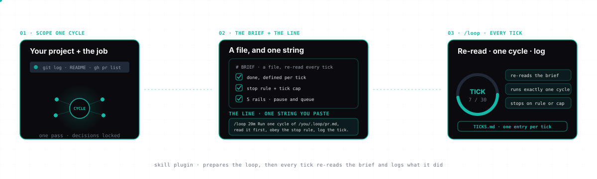

<picture>
  <source media="(prefers-color-scheme: dark)" srcset=".github/assets/logo-dark.svg">
  <source media="(prefers-color-scheme: light)" srcset=".github/assets/logo-light.svg">
  
</picture>

<p align="center">
  <a href="LICENSE"></a>
  <a href="#plugins"></a>
  <a href="https://github.com/Aboudjem/10x/stargazers"></a>
</p>

<p align="center">
  <b>English</b> ·
  <a href="READMEs/zh-CN.md">简体中文</a> ·
  <a href="READMEs/ja.md">日本語</a> ·
  <a href="READMEs/es.md">Español</a> ·
  <a href="READMEs/fr.md">Français</a>
</p>

<p align="center"><b>A curated marketplace of developer tools for Claude Code.</b><br/>No bloat. Tested. Works in any AI editor.</p>


---

## How it works

<p align="center">
  
</p>

```bash
claude plugin marketplace add Aboudjem/10x
```

> [!TIP]
> One install command. Every plugin wires up its MCP tools, slash commands, and agents automatically.

Versions here follow each plugin's own releases; see [docs/SYNC.md](docs/SYNC.md).

---

## Plugins

Seven plugins today. Every one of them passes the [quality bar](#the-10x-bar) below.

### &nbsp;&nbsp;Find bugs before your users do

> Point it at your running app. It walks your real user flows in a real browser and tells you what's actually broken, with proof.

It opens your app in a real browser and clicks through it the way a person would. You get back a ranked list of what broke, and each finding carries the steps to reproduce it. It needs your app running: with no server up, sniff drops to reading your source instead.

<p align="center"></p>

```bash
claude plugin install sniff@10x     # as a plugin (primary)
npx sniff-qa                        # as a standalone CLI
# one-line multi-CLI install (Cursor, Codex, Gemini, Copilot, and more):
curl -fsSL https://raw.githubusercontent.com/Aboudjem/sniff/main/install.sh | bash -s codex
```

441 tests. 12 classes of bugs.

<p><a href="https://github.com/Aboudjem/sniff">GitHub →</a> &nbsp;·&nbsp; <a href="https://www.npmjs.com/package/sniff-qa">npm →</a></p>

---

### &nbsp;&nbsp;Your design quality, measured

> **ESLint for design.** It finds the exact line, the measured wrong value, and the exact fix.

It reads your CSS, JSX, and Tailwind config, then scores twelve parts of your design, among them color, type, spacing, and accessibility. Each finding names the file, the line, the value that is wrong, and the fix. It reports and never edits, so applying a fix stays your call.

<p align="center"></p>

```bash
claude plugin install ui-ux-suite@10x   # as a plugin (primary)
npx ui-ux-suite                         # as a standalone CLI
# one-line multi-CLI install (Cursor, Codex, Gemini, Copilot, and more):
curl -fsSL https://raw.githubusercontent.com/Aboudjem/ui-ux-suite/main/install.sh | bash -s codex
```

311 tests. 12 weighted dimensions.

<p><a href="https://github.com/Aboudjem/ui-ux-suite">GitHub →</a> &nbsp;·&nbsp; <a href="https://www.npmjs.com/package/ui-ux-suite">npm →</a></p>

---

### &nbsp;&nbsp;One-page explainers you can read in about 5 minutes

> Turn any topic or coding session into a beautiful, dark-mode, mobile-first explainer you can double-click to open. No server, no internet, no dependencies.

Give it a topic, or point it at a coding session, and you get one HTML page you can open by double-clicking it. It works offline, and every claim carries a source. A fast checker scores the page before you ship it, and that score is a structural signal, not a peer review.

<p align="center"></p>

```bash
claude plugin install recap-studio@10x   # as a plugin (primary)
/recap "Latest AI models"                # in any Claude Code session
# one-line multi-CLI install (Cursor, Codex, Gemini, Copilot, and more):
curl -fsSL https://raw.githubusercontent.com/Aboudjem/recap-studio/main/install.sh | bash -s codex
```

43 tests across 5 test-bearing packages.

<p><a href="https://github.com/Aboudjem/recap-studio">GitHub →</a> &nbsp;·&nbsp; <a href="https://github.com/Aboudjem/recap-studio/blob/main/docs/architecture.md">Architecture →</a></p>

---

### &nbsp;&nbsp;Audit your AWS bill, safely

> Ask Claude to audit your AWS bill. Get a clear savings plan where every number is checked against live AWS pricing, and nothing gets deleted without your say-so.

It reads your account, works out what every resource really costs, and finds the idle and over-sized ones. Each saving carries a confidence level, the evidence behind it, and a way to undo it. It is read-only by default, so nothing changes until a dry run passes and you say yes.

<p align="center"></p>

```bash
claude plugin install aws-cost-audit@10x   # as a plugin (primary)
# one-line install into another CLI's skills directory:
curl -fsSL https://raw.githubusercontent.com/Aboudjem/aws-cost-audit-skill/main/install.sh | bash -s codex
```

<p><a href="https://github.com/Aboudjem/aws-cost-audit-skill">GitHub →</a></p>

---

### &nbsp;&nbsp;Come back to proof it's done

> Hand Claude a huge task. Come back to proof it's done — not a promise that it is.

For jobs too big to sit and watch, goalify writes the brief (a file holding what the run has to do) and the condition (one line you paste into `/goal`). You clear the chat, paste that line, and a fresh session does the whole job, then closes by quoting the checks passing. A run that stops is not proof it finished, so read that closing evidence before you trust it.

<p align="center"></p>

```bash
claude plugin install goalify@10x   # as a plugin (primary)
/goalify <your task>                # then, in any Claude Code session
```

<p><a href="https://github.com/Aboudjem/goalify">GitHub →</a></p>

---

### &nbsp;&nbsp;Make AI text read like a person wrote it

> Humanizer is a free, open-source AI writing humanizer and detector.

Paste in text and it scores how much of it reads as machine-written, or rewrites it in a voice you pick. The rewrite varies sentence length the way people do. It is one Markdown file, nothing leaves your machine, and it is aimed at better writing rather than at fooling detectors.

<p align="center"></p>

```bash
claude plugin install humanizer@10x   # as a plugin (primary)
/humanizer "<your text>"              # then, in any Claude Code session
```

55 patterns, 5 voices, a 0-100 AI-tell score.

<p><a href="https://github.com/Aboudjem/humanizer-skill">GitHub →</a></p>

---

### &nbsp;&nbsp;Hand off a job that repeats

> Hand Claude a job that repeats. Come back to a log of what every tick did — not a loop you have to babysit.

Some jobs never quite finish: watching a deploy settle, sweeping new bug reports every hour. loopify writes the brief (a standing file the loop re-reads each run) and the line (one string you paste into `/loop`), with a tick cap and a stop rule carried inside the line. Every tick logs what it did to `TICKS.md`, and you should read that log: a loop that found nothing to do looks the same from outside as one that fixed things all afternoon.

<p align="center"></p>

```bash
claude plugin install loopify@10x   # as a plugin (primary)
/loopify <your job>                 # then, in any Claude Code session
```

<p><a href="https://github.com/Aboudjem/loopify">GitHub →</a></p>

---

## Works with any AI editor

<p align="center">
  
</p>

sniff, ui-ux-suite, and recap-studio are dual mode: install one as a Claude Code plugin, or run it as a plain MCP server in the editor of your choice. aws-cost-audit, goalify, humanizer, and loopify are Claude Code skills rather than MCP servers, so they run in Claude Code.

```bash
npx sniff-qa            --mcp
npx ui-ux-suite         --mcp
# recap-studio also ships an MCP server (see its README; requires a local build)
```

Each tool plugin ships a one-line `install.sh` that wires it into another CLI's skills directory (`curl -fsSL https://raw.githubusercontent.com/Aboudjem/<repo>/main/install.sh | bash -s <cli>`), plus `.cursor-plugin` and `.copilot-plugin` manifests. Each project's README has copy-paste snippets for Cursor, VS Code + Copilot, Codex, Gemini, Windsurf, and Continue.dev.

---

## The 10x bar

Every plugin here passes this bar. If it stops passing, it gets removed.

| | |
|---|---|
| **Zero bloat** | Vanilla Node.js, no runtime dependencies |
| **One-command install** | No config files, no API keys |
| **Real tests** | Not aspirational, not "coming soon" |
| **Dual mode** | Works as a Claude Code plugin AND as an MCP server |
| **Actively maintained** | Shipped this quarter, not abandoned last year |
| **No telemetry** | Runs locally, your code never leaves your machine |

The full checklist lives in [`QUALITY-BAR.md`](QUALITY-BAR.md). Maintainers re-verify every plugin against it on a quarterly review.

> [!NOTE]
> Current roster: **sniff 0.7.0** (441 tests), **ui-ux-suite 0.5.0** (311 tests), **recap-studio 0.4.0** (43 tests across 5 test-bearing packages), **aws-cost-audit 0.2.0** (read-only by default), **goalify 2.5.0**, **humanizer 0.6.2** (55 patterns), **loopify 1.0.0**. Last verified 2026-09-01.

---

## Contributing

Got a plugin that belongs here? See [CONTRIBUTING.md](CONTRIBUTING.md).

---

## Star History

<a href="https://star-history.com/#Aboudjem/10x&Date">
  <picture>
    <source media="(prefers-color-scheme: dark)" srcset="https://api.star-history.com/svg?repos=Aboudjem/10x&type=Date&theme=dark" />
    <source media="(prefers-color-scheme: light)" srcset="https://api.star-history.com/svg?repos=Aboudjem/10x&type=Date" />
    
  </picture>
</a>

---

<p align="center">
  If 10x helped you ship better code, consider starring it.<br/>
  It helps other devs find these tools.
</p>

<p align="center">
  <a href="https://www.linkedin.com/in/adam-boudjemaa/"></a>
  <a href="https://x.com/AdamBoudj"></a>
  <a href="https://adam-boudjemaa.com/"></a>
</p>

<p align="center">
  <sub>Built by <a href="https://github.com/Aboudjem">Adam Boudjemaa</a> · MIT License · No telemetry · No data collection</sub>
</p>
